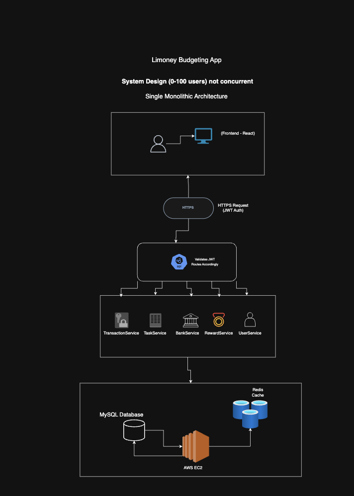
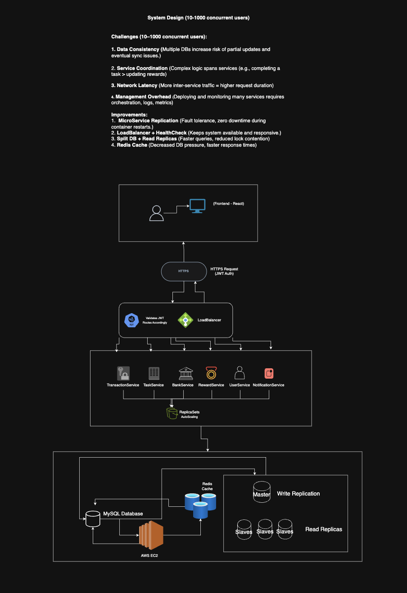
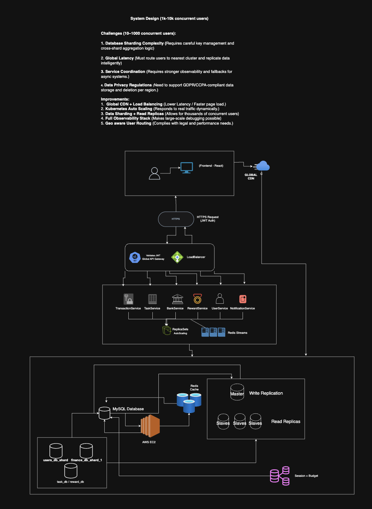
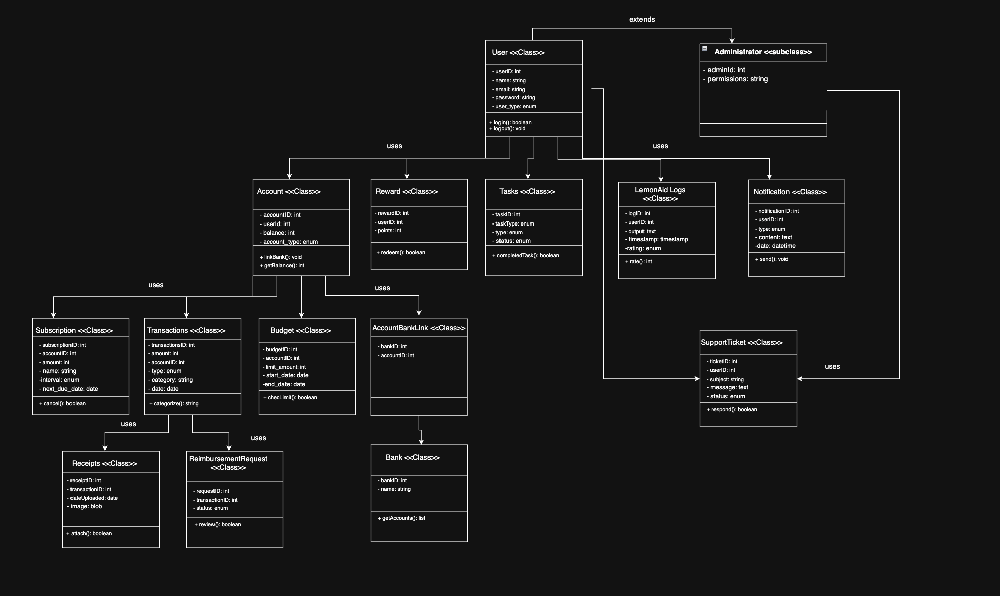

# Backend Architecture

**ALL SCALE DESIGN**

The Limoney Budgeting App for 0-100 (not concurrent) users uses a single monolithic architecture. The frontend (React) communicates via HTTPS (JWT Auth) to a backend API, which validates JWT and routes requests to services such as TransactionService, TaskService, BankService, RewardService, and UserService. All services interact with a single MySQL database (hosted on AWS EC2) and an optional Redis cache for session/AI caching.

**MEDIUM SCALE DESIGN**

For 10-1000 concurrent users, the system introduces microservice replication, load balancing, and read replicas for the database. The backend is horizontally scalable with Dockerized microservices, an auto-scaling NGINX load balancer, and health checks. The MySQL database uses master-read replica architecture for scalability, and Redis is used for caching AI and frequent queries. Improvements include fault tolerance, health checks, and reduced DB pressure.

**LARGE SCALE DESIGN**

For 1k-10k concurrent users, the system leverages Kubernetes-managed microservices, global CDN, and database sharding by user region. The backend is orchestrated with Kubernetes for auto-scaling and CI/CD. The database layer uses sharding and a mix of read/write replicas, with multi-layer Redis caching. Security is enhanced with rate-limiting, API key enforcement, and mutual TLS between services. The architecture supports global latency reduction and compliance with data privacy regulations.

**ARCHITECTURE SUMMARY**

1. Microservices Architecture Limóney uses a domain-driven microservices architecture where each major business capability is its own independently deployable service: UserService, BankService, BudgetService, SubscriptionService, TaskService, AIRecommendationService, RewardService

Services communicate via REST APIs and asynchronous messaging (for AI or reward triggers)Backend System Design.

2. Load Balancing Using an NGINX reverse proxy or AWS ALB, traffic is routed evenly. Health checks ensure services are available. Load balancing supports horizontal scaling, allowing the system to increase availability and responsivenessBackend System Design.
3. Caching Strategies Cache-aside pattern for database query results (ex, user budget history).

Uses LRU eviction for memory optimizationBackend System Design.

4. Reliability and Fault Tolerance Each service runs in its own container managed by Docker / Kubernetes, allowing independent failure recovery.

Circuit breakers protect the system from cascading failures (Resilience4j).

Use Retry + Timeout policies to stabilize connections.

5. Containers Docker containers isolate each service.

Portable environments between local → staging → production.

Kubernetes handles orchestration, deployment, health checks, scaling, and rolling updatesBackend System Design.

6. Data Replication and Consistency Master-Slave replication for MySQL improves read throughput.

Sensitive operations (ex., TransactionService, SavingsService) use synchronous writes for consistency.

Some services may rely on eventual consistency for performanceBackend System Design.

7. Security Considerations JWT authentication for all user requests.

Role-Based Access Control (RBAC): Admins vs. Customers.

Mutual TLS between services.

Rate limiting + logging at the gateway.

Data encryption (at rest using AES-256, in transit via TLS)Backend System Design.

**UML DESIGN**

The following UML diagram illustrates the key domain classes and service interfaces for the Limoney backend system.&#x20;

<figure><figcaption></figcaption></figure>
