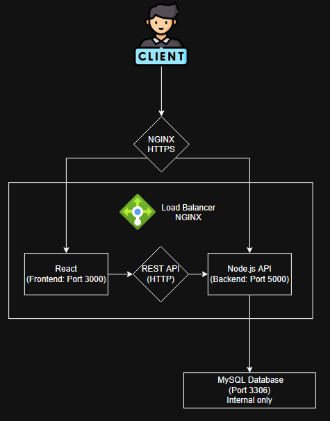
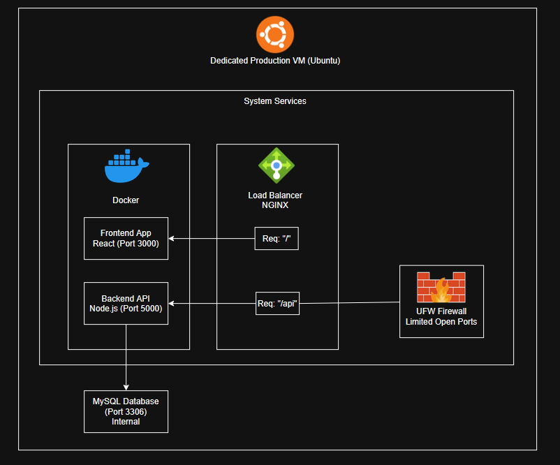

# High Level Application Network Protocols and Deployment Design

***

## Network & Development Diagram

This diagram shows a secure full-stack web app deployment. Users connect with HTTPS to a cloud Virtual Machine protected by a UFW firewall. NGINX routes traffic to Dockerized React frontend and Node.js backend services, which access a MySQL database internally.

***

## Application Networks Diagram

### Protocols

Network uses HTTPS for securing client access with NGINX, routing to React frontend and Node.Js backed. The backend accesses MYSQL database internally over TCP/IP. Services run on Docker bridge network, with security enforced through SSL/TLS, CORS. and a UFW firewall that restricts access only to essential ports to the application to work. NGINX is the main gateway and proxy which isolates the internal services from the public.

***

## Deployment Diagram

This diagram illustrates the system's structure on a dedicated Ubuntu server. Docker manages the React frontend and Node.js backend processes. NGINX handles incoming traffic and routes it to the appropriate service. A UFW firewall restricts network access, allowing only essential ports. The backend securely connects to an internal or cloud-hosted MySQL database.

***

## Integration with External Components

### External Components:

* no third party API's so far

### Internal Libraries

* bycrypt: for hasing passwords
* dotenv: for ".env" variable handling
* cors: for seucring cross-origin request
* mysql12: for database connection
