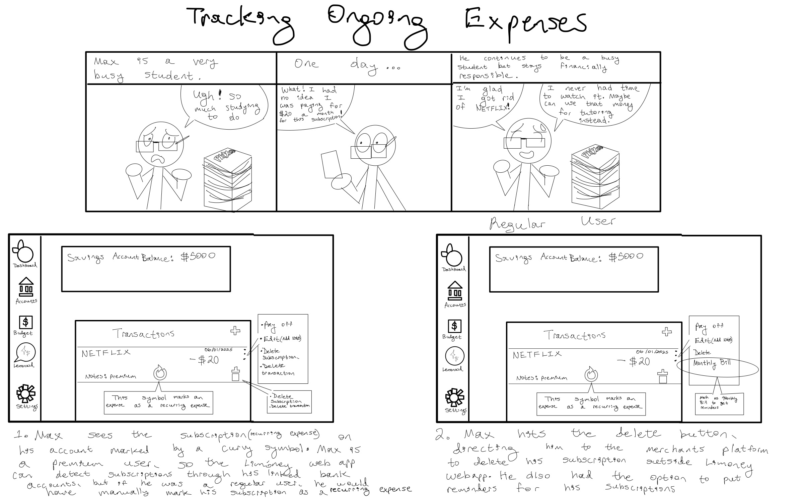

# Mockups/Storyboards

### 1. Checking Credit Card expenses
<figure><figcaption></figcaption></figure>

### 2. Tracking Multiple Reimbursments and Predicting Balances
<figure><figcaption></figcaption></figure>

### 3. Log Transactions
<figure><figcaption></figcaption></figure>

### 4. Security Concern
<figure><figcaption></figcaption></figure>

### 5. Recieve AI Suggestions
<figure><figcaption></figcaption></figure>

### 6. Currency Exchange
<figure><figcaption></figcaption></figure>

### 7. Tracking Ongoing Expenses
<figure><figcaption></figcaption></figure>

### 8. Predicting Balances at The End of the Month
<figure><figcaption></figcaption></figure>

### 9. Signing UpIntro UI
<figure><figcaption></figcaption></figure>

### 10. ChatbotAI Assistance
<figure><figcaption></figcaption></figure>

### 11. Credit Score Inquiry
<figure><figcaption></figcaption></figure>